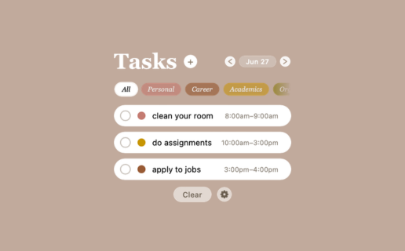

# Übersicht Task Tracker Widget

A simple, draggable task tracker for [Übersicht](http://tracesof.net/uebersicht/) — add tasks with a category and a time range, filter by category, page through days, and track what's overdue, right on your desktop.

## Installation

1. Install [Übersicht](http://tracesof.net/uebersicht/) if you haven't already.
2. Download or clone this repo.
3. Copy `Task Tracker.widget` into `~/Library/Application Support/Übersicht/widgets/`.
4. Refresh Übersicht (right-click the menu bar icon → Refresh, or `uebersicht://refresh-all`).

## Features

- Click **+** next to the title to add a task inline — pick a category, type a name, and give it a start/end time (e.g. typing `5` is read as `5:00pm`).
- Tasks without a name or a valid time get a red outline and won't save until both are filled in.
- Click a task's name to rename it in place.
- Hover a task to reveal a next-day arrow (bump it to tomorrow) and a remove button.
- Filter pills under the header let you narrow the list to one category, with a `(<) Today (>)` control to page between days.
- Tasks past their end time that aren't checked off turn red.
- A **Clear** button removes all completed tasks; the gear icon next to it opens a settings panel to rename categories and recolor them.
- Everything is stored in `localStorage`, so your tasks, categories, and filters persist across restarts.

## Customizing

Open `Task Tracker.widget/Task Tracker.coffee` — colors, fonts, and layout all live in the `style` block at the top, and the behavior lives in `afterRender`. The default category palette (`CATEGORY_DEFAULTS`) and seed tasks (`defaultTasks`) are good starting points if you want to fork this for your own workflow.
